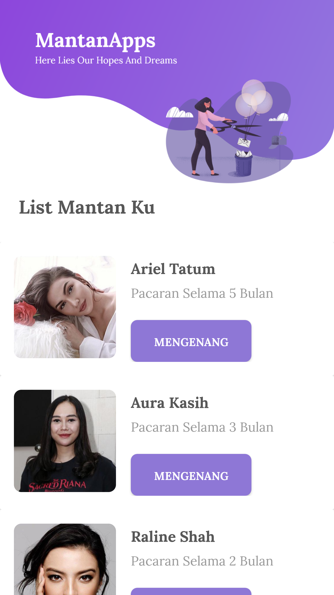
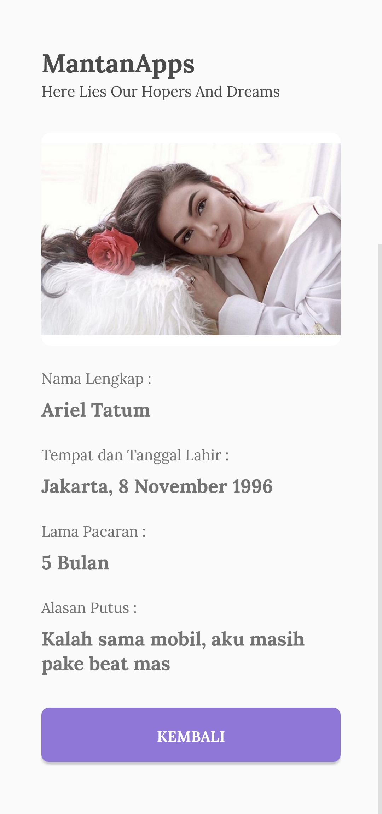
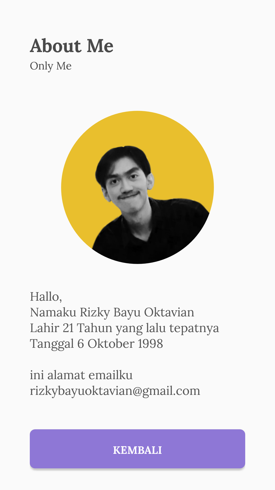

# MantanApps

mantanApps menceritakan daftar list mantan - mantan saya yang saya jadikan aplikasi agar nantinya mudah untuk mengenangnya, aplikasi ini saya buat pertama kali dengan membuat mockup terlebih dahulu pada adobe xd , lalu mengkonversi mockup tersebut menjadi sebuah layout pada android studio, selanjutnya adalah mengoding sesuai dengan ketentuan yang berlaku.

# komponen yang digunakan 
- [x] Recycler View
- [x] Basic layout
- [x] Data in array

# Screenshoot

berikut ini adalah screenshoot dari aplikasi yang saya buat :

**Dashboard**  
 

**Detail**  
 

**About**  
 

made with :heart: in Cimahi Padasuka by @rbayuokt

